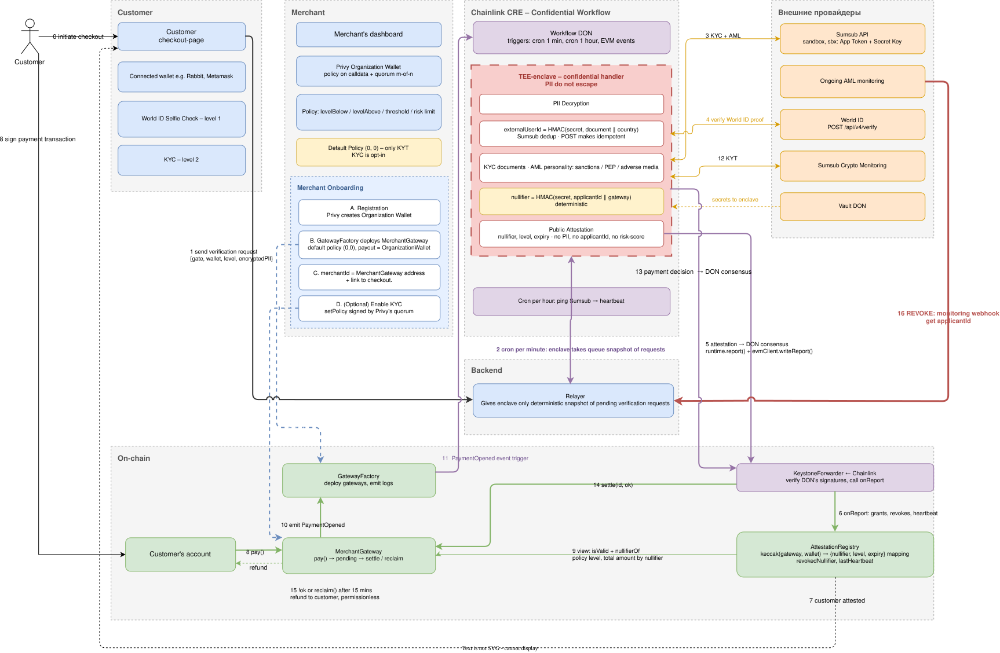

# ComplianceGateway

Confidential compliance gateway for crypto checkouts that keeps identity out of the chain.

## Purpose

Let any merchant – a regulated emitent or a webshop, accept stablecoin payments under a
compliance policy they choose, without the merchant, the platform or the chain ever seeing the
payer's (customer's) documents.

## Problem

Accept crypto long enough and a sanctioned address will pay you. You find out from your bank, your CEX, your processor or your regulator — after the money is already sitting in your account, looking exactly like the rest of it.

That leaves merchants three bad options:

- **Hand it to a custodial PSP.** They take a cut, hold your funds, and keep your customers' passports in their database. Their breach is your headline.
- **KYC everyone.** Now you run a document-collection business you never wanted, and a chunk of your customers walk away at the upload screen.
- **Screen nothing and hope.** Free address oracles only flag addresses that are themselves on the OFAC list. Funds that came through a mixer two hops ago pass as clean.

The customer's side is no better: the same passport photo scattered across a dozen merchant
dashboards, or an on-chain "verified" badge that permanently links every wallet they will ever own.

---

**ComplianceGateway** addresses this problem by providing the non-custodial payment gateway
that runs KYC and AML inside a confidential enclave: screening is on from the very first payment and
takes no integration work. No document ever reaches the merchant, the chain or us. And the money
is never ours to hold, at any point, by design.

## Solution

Three kinds of data, three different places to check them:

| Data | What it really is | Where it gets checked |
|---|---|---|
| Address on a sanctions list | public information | free oracle, inline in `pay()` |
| Where the funds came from | paid API and a trade secret | TEE-enclave |
| Who the payer is | passport-grade personal data | TEE-enclave |

**Screening is mandatory, identity is optional.** A new gateway ships as "screen the money, ask
nothing else". The merchant turns on KYC when their business actually needs it.

**The chain never sees a person.** Documents are checked inside a Chainlink CRE confidential
workflow running in a TEE. What comes out is one opaque number — a `nullifier` — plus a level and an
expiry date. No name, no country, no document, no risk score.

**Non-custodial — we never hold your money.**  Funds go straight into the merchant's own gateway contract, wait there for the length of one screening window, and leave through one of exactly two exits: **the merchant, or back to the payer**.

### What each side gets

**Merchant** — a payment gateway of your own in one click, no-code, no documents in your database, no custodian holding your money. Funds can only ever go to you or back to the payer.

**Customer** — your passport goes to the verification provider and nowhere else. Two merchants cannot tell you are the same person. If a payment fails screening, the refund is automatic.

**Compliance** — sanctions and provenance screening on every payment, a per-person daily limit that survives a wallet change, and revocation that kills all of a person's wallets at once.

## Architecture

### How it Works

**Verification** — once per wallet, and only if the merchant asks for it:

0. Customer opens the merchant's checkout and connects an ordinary wallet.
1. Checkout drops a request `{gateway, wallet, level}` into the Relayer queue. Documents go from the Sumsub widget straight to Sumsub — they never pass through our backend.
2. Once a minute the enclave pulls a snapshot of that queue itself.
3. Inside the enclave: Sumsub lookup — documents, sanctions, PEP, adverse media.
4. For level 1 it is World ID Selfie Check instead — proof bound to the wallet address.
5. The enclave derives the `nullifier` from the document and the merchant's gateway address, and reports `{nullifier, level, expiry}` through DON consensus.
6. `KeystoneForwarder` checks the DON signatures and writes grants, revocations and the heartbeat into `AttestationRegistry` in one batch.
7. Checkout sees the result as an on-chain event.

**Payment**

8. Customer execute `pay()`. The funds are held in a pending window, not forwarded yet.
9. The gateway reads the registry and enforces its own policy: required level, threshold, and a 24-hour running total tracked **per person**, so splitting a payment across wallets does not help.
10. The gateway has `GatewayFactory` emit `PaymentOpened` — one fixed address, so gateways deployed later still trigger the workflow.
11. The event wakes the workflow.
12. The enclave screens where the money came from, against the risk ceiling the merchant set.
13. A yes/no — never the score — goes through DON consensus.
14. `settle(id, ok)` releases the payment to the merchant.
15. On a "no", or via `reclaim()` after 15 minutes that anyone can call, the money goes back to the payer. It cannot get stuck.

**Afterwards Monitoring**

16. If monitoring flags someone later, the webhook revokes them **by nullifier** — every wallet that person used at that merchant dies at once.
- An hourly heartbeat proves the monitoring is alive. After 48 hours of silence every attestation
  stops working: a broken system must not look like a clean one.

### Stack

| Layer | Tech |
|---|---|
| Confidential compute | Chainlink CRE Confidential Workflow (TEE), Go |
| Secrets | Chainlink Vault DON |
| On-chain | Solidity, Base Sepolia + Arc testnet, USDC |
| Frontend | Next.js (checkout + merchant dashboard) |
| Merchant custody | Privy Organization Wallets, policy engine, m-of-n key quorums |

### Components

| Component | Owner | Role |
|---|---|---|
| `attestor-workflow` (Go) | us | CRE confidential workflow: verification, nullifier derivation, provenance screening, revocation, heartbeat |
| `AttestationRegistry.sol` | us | `keccak(gateway, wallet) → {nullifier, level, expiry}`, `revokedNullifier`, `lastHeartbeat`. Written only by the workflow via the forwarder |
| `GatewayFactory.sol` | us | Deploys merchant gateways; **the only emitter of `PaymentOpened`** |
| `MerchantGateway.sol` | merchant | Policy, pending window, `settle` / `reclaim`, cumulative spend per nullifier |
| `relay` (Next.js API route) | us | Queue of verification requests and webhooks + Sumsub WebSDK token minting. A dumb pipe: no enclave key, no read scope on Sumsub, signs nothing on-chain |
| `checkout` / `dashboard` | us | Payer flow; merchant onboarding, policy, attestation and payment lists |

### External Providers

| Provider | Used for | Notes |
|---|---|---|
| Sumsub | KYC documents, AML on the person, ongoing monitoring | sandbox; two app tokens — create-only for the relayer, read-only for the enclave |
| Sumsub Crypto Monitoring | fund provenance (KYT) | enclave key; billed per payment |
| World ID | Selfie Check — level 1 liveness + uniqueness | plain REST, no SDK, `signal` = wallet |
| Chainalysis Sanctions Oracle | OFAC SDN address screening | keyless, free, called directly from the gateway |
| Chainlink Vault DON | enclave secrets | delivered straight into the TEE |
| Privy | merchant organization wallet, policy engine, key quorums | `setPolicy` also works with a plain owner signature; quorum is an add-on |

## Roadmap

- [ ] Wallet rebind by signature — bind a new address to an existing attestation without a repeat
  Sumsub session.
- [ ] Sumsub Reusable KYC across businesses.
- [ ] Multi-token gateways (per-token decimals, fee-on-transfer accounting, reentrancy).
- [ ] Whitelist payment tokens in `GatewayFactory` — `deploy()` currently takes any ERC20 from calldata; only USDC/EURC are offered in the UI.
- [ ] Production Sumsub keys; BYOK AML aggregators above ~50k checks/month.
- [ ] Fiat off-ramp
- [ ] Cross-chain payment router.

